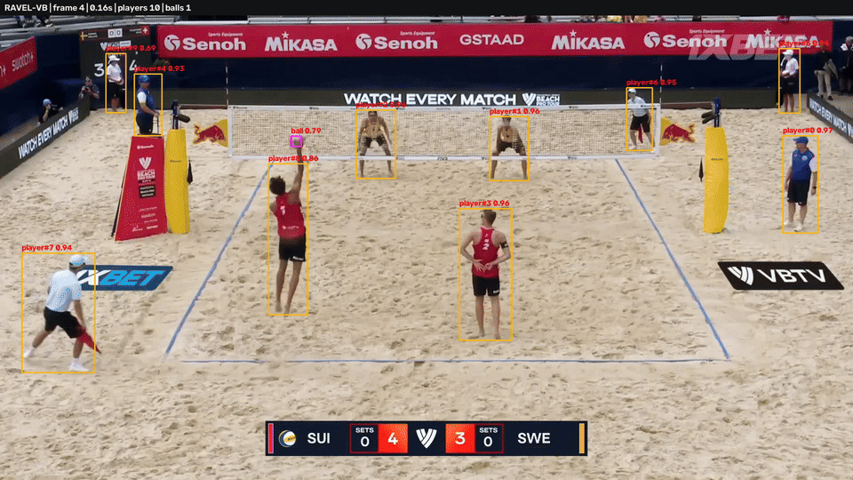

# RAVEL-VB

**Region-Aware Vector Evolution and Linking for Volleyball**  
**Эволюция и связывание региональных векторов для волейбольного видео**

RAVEL-VB — компактная временная модель для волейбольного видео. Она находит
игроков и мяч, связывает регионы игроков между кадрами и умеет создавать
готовое демонстрационное видео с разметкой. В каталоге находятся обученные
OpenVINO-веса и полностью автономный CPU inference.

<p align="center">
  
</p>

Архитектура вдохновлена идеями активного восприятия: модель выбирает небольшой
набор значимых регионов, представляет их векторами и развивает во времени. При
этом RAVEL-VB является обычной обучаемой нейросетевой моделью, а не реализацией
проприетарной технологии TAPe.

## Содержимое

```text
RAVEL-VB/
├── infer_openvino.py          Автономный inference и рендер видео
├── models/
│   ├── ravel_vb_v1.xml        Граф OpenVINO
│   ├── ravel_vb_v1.bin        FP16-веса модели
│   └── ravel_vb_v1.json       Конфигурация и тензорный интерфейс
├── requirements.txt
├── README.md
└── README_ru.md
```

Для запуска не нужны исходники тренировочного проекта и PyTorch.

## Устройство модели

```text
RGB-клип из 9 кадров
      │
      ├── Tiny CNN/FPN ──► динамические регионы ──► multi-scale sampling
      │                                             │
      │                                             ▼
      │                              persistent region vectors
      │                                             │
      │                              temporal association + GRU
      │                                             │
      │                                   рамки и ID игроков
      │
      └── временная grayscale-сетка ──────────────► положение мяча
```

Основные характеристики:

- вход: клип из 9 RGB-кадров;
- рабочее разрешение: 512 × 288;
- игроки: динамические Top-K proposals, локальный многомасштабный sampling,
  persistent queries и рекуррентная временная ассоциация;
- мяч: независимая временная confidence/offset-сетка;
- OpenVINO IR со сжатыми FP16-весами;
- оптимизация для CPU с настройкой потоков и performance hint.

## Установка

Рекомендуется Python 3.10 или новее.

Через `uv`:

```bash
uv venv --python 3.12
uv pip install -r requirements.txt
```

Через стандартный `venv`:

```bash
python3 -m venv .venv
source .venv/bin/activate
python -m pip install -r requirements.txt
```

## Быстрый запуск

Получить JSON и демонстрационное видео:

```bash
uv run python infer_openvino.py input.mp4 \
  --output out/predictions.json \
  --output-video out/result.mp4
```

Входящая в комплект модель выбирается автоматически. Другую модель можно
указать через `--model path/to/model.xml`.

Пример с явной настройкой CPU:

```bash
uv run python infer_openvino.py input.mp4 \
  --stride 9 \
  --performance-hint LATENCY \
  --num-threads 4 \
  --output out/predictions.json
```

Все параметры:

```bash
uv run python infer_openvino.py --help
```

## Настройки детекции

| Параметр | По умолчанию | Назначение |
|---|---:|---|
| `--stride` | `9` | Расстояние между началами клипов, допустимо 1–9 |
| `--score-threshold` | `0.35` | Открывает трек игрока и фильтрует мяч |
| `--close-threshold` | `0.20` | Удерживает уже открытый трек игрока |
| `--hysteresis-frames` | `2` | Перекрывает короткие пропуски детекции |
| `--no-player-hysteresis` | выкл. | Независимая покадровая фильтрация |
| `--warmup-runs` | `3` | Прогрев OpenVINO вне benchmark |
| `--num-threads` | auto | Явное число inference-потоков OpenVINO |
| `--include-features` | выкл. | Добавляет точки головы/ног и 128-D векторы |

Понижение порогов повышает полноту вместе с числом ложных срабатываний. Для
демонстрации рекомендуется начать со значений по умолчанию и сначала менять
`--score-threshold`.

## Формат JSON

Пример предсказания:

```json
{
  "frame_index": 42,
  "time_sec": 1.4,
  "class_id": 0,
  "class_name": "player",
  "score": 0.91,
  "bbox_xyxy": [412.3, 128.7, 516.8, 431.2],
  "track_id": 3,
  "interpolated": false
}
```

`bbox_xyxy` задаётся в пикселях исходного видео. Мяч имеет `class_id: 1` и не
получает постоянный track ID. В объекте `benchmark` сохраняются чистая задержка
модели и полная скорость pipeline.

## Область применения и ограничения

- Модель обучена для волейбольных видео и не является универсальным детектором.
- `track_id` — краткосрочная временная связь, а не идентификатор личности или
  полноценный ReID.
- Наиболее сложный объект — очень маленький, размытый или перекрытый мяч.
- Склейки камер, экстремальные ракурсы и данные, сильно отличающиеся от
  обучающей выборки, могут снижать точность.
- В комплект входит лучший validation checkpoint с эпохи 80; экспортированные
  веса сжаты до FP16.

## Название

**RAVEL** расшифровывается как **Region-Aware Vector Evolution and Linking**:
регионы-кандидаты превращаются в векторы, сохраняются и развиваются внутри
видеоклипа, после чего связываются между соседними кадрами. `VB` обозначает
версию модели для волейбола.
